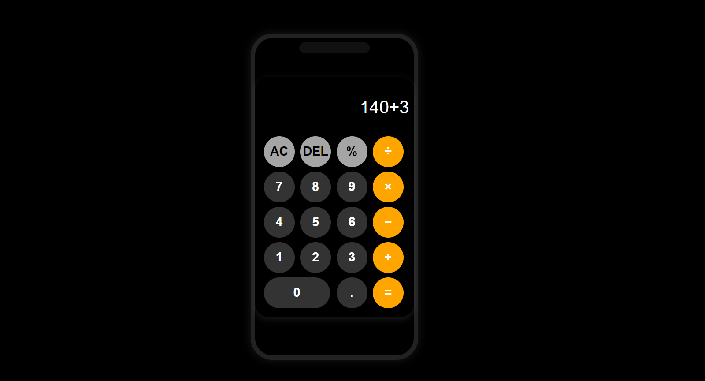

# 🖩 RG Calculator

This project is a stylish **modern calculator** built using **HTML, CSS, and JavaScript**. It features a sleek **dark theme**, smooth **button animations**, and **keyboard support** for a seamless user experience.

---

## 🚀 Features
✔ **Elegant Design with Rounded Buttons**  
✔ **Dynamic Result Display (Real-Time Calculation)**  
✔ **Keyboard Support (Use Number & Operator Keys)**  
✔ **Smooth Press Effects & Responsiveness**  
✔ **Dark Theme Interface**  

---

## 🎥 Preview  


---

## 🛠️ Technologies Used
- **HTML** – Structure of the calculator  
- **CSS** – Styling with modern UI  
- **JavaScript** – Functional logic for calculations and keyboard inputs  

---

## 🔧 Installation & Usage
1. **Clone this repository:**
   ```bash
   git clone https://github.com/yourusername/rg-calculator.git
2. **Open index.html in a browser**
-**Alternatively, use Live Server in VS Code for a better experience.**

---
## 🎮 How to Use
- ✔ **Click buttons to perform calculations.**
- ✔ **Use the keyboard for input:**
- ✔ **0-9 → Enter numbers**
- ✔ ** + - * / % → Operators**
- ✔ ** Enter → Equals (=)**
- ✔ ** Backspace → Delete last digit**
- ✔ ** Escape (Esc) → Clear display**
## 📌 Future Improvements
- 🔹**Add a history feature to store previous calculations**
- 🔹**Improve animations for button presses**
- 🔹**Support dark/light mode toggle**

## 🤝 Contributing
Feel free to fork this repository and improve the project. If you find any bugs or want to request a feature, create an issue!

## 📄 License
This project is open-source and available under the Creative Commons Zero v1.0 Universal License.

## 💡 Developed with ❤️ by RG

